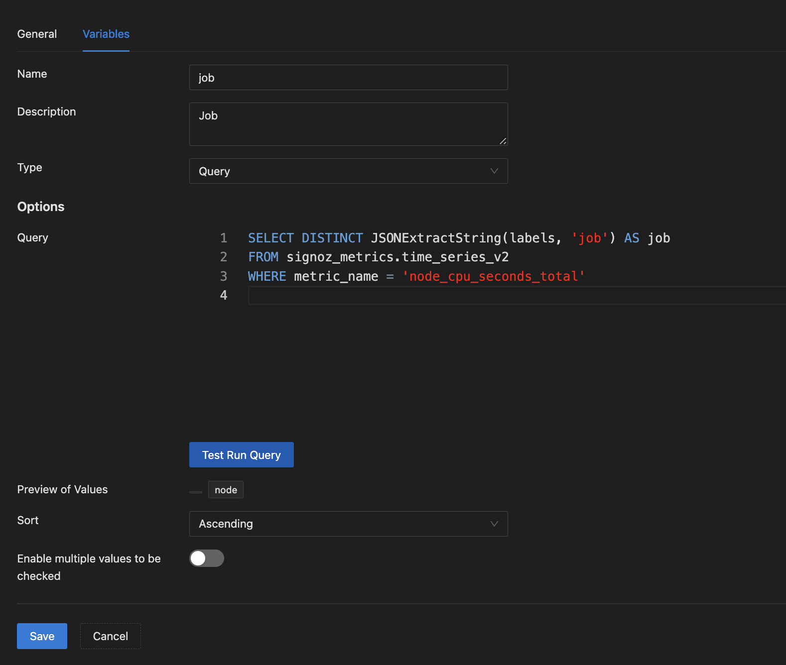
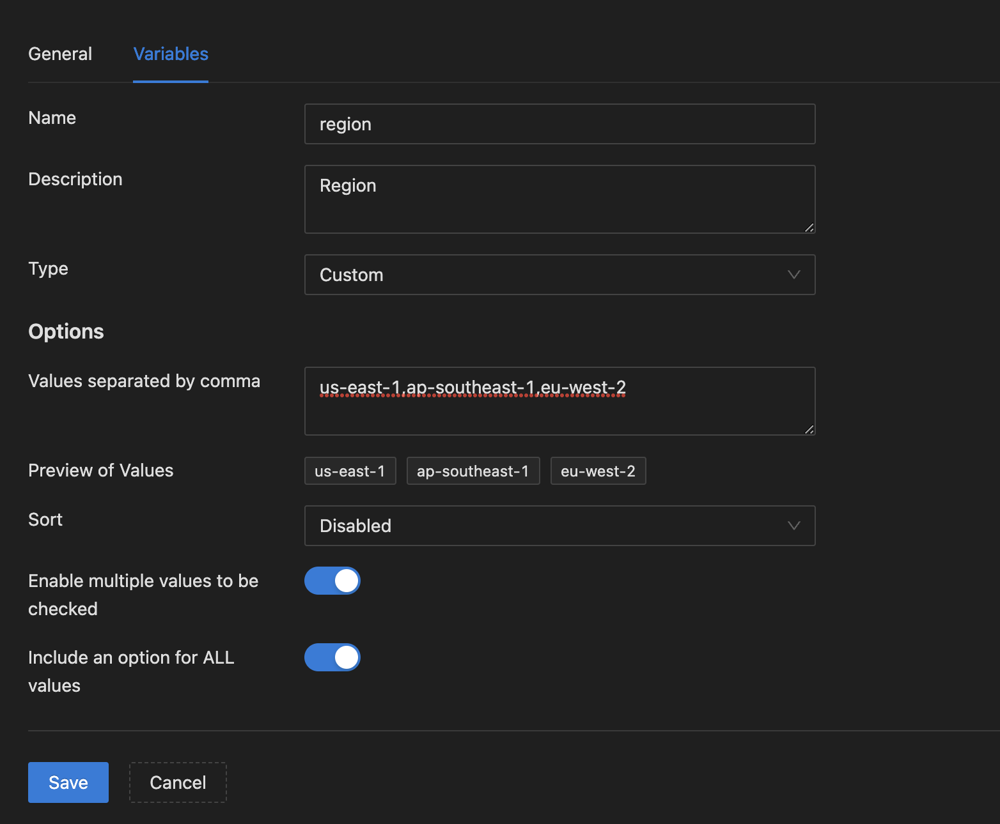

import GetHelp from '../shared/get-help.md'
import PrereqsInstrument from '../shared/prereqs-instrument.md'

## Prerequisites

<PrereqsInstrument />


## Variables

Variables are now supported for the dashboard panel chart for all three query types. The widget plots can use these variables and update the charts dynamically without updating the query for each value. When the value of the variable changes, the refreshed dashboard will reflect the new value. Variables allow users to make interactive dashboards. Variables are most commonly used to avoid hard coding the values for host names, Kubernetes pods, namespaces, etc. Variables are independent for each dashboard. Variables are shown using the dropdowns at the top of the dashboard.

## Add a Variable to a Dashboard

To add a variable to a dashboard, follow the steps below:

1. From the left sidebar, choose **Dashboards**.
2. Find the dashboard to which you want to add a new variable.
3. Select **Configure**.
4. Select **New Variables** from the **Variables** section tab.
5. Populate the following fields:
    1. **Name**: Name of the variable. This is used in Metrics builder/ClickHouse query/ PromQL later
    2. **Description**: Enter a brief and meaningful description of your variable.
    3. **Type**: Select the variable type from the list of available choices, and the UI changes accordingly.
    4. _(Optional)_ **Sort**: Sort the values from the above variable type if applicable.
    5. _(Optional)_ **Enable multiple values to be checked**: Make dropdown multi-select
    6. _(Optional)_ **Include an option for ALL values**: Show the `ALL` option which includes all options from the multi-select dropdown
6. When you’ve finished, select the **Save** button.


## Variables types

SigNoz supports three ways of creating variables: query, custom, and textbox.

1. Query   - A SQL query that fetches data from ClickHouse (only supported data source at the time) server SigNoz configured to use

    Example: You want to query the list of jobs from the metrics database and use them as a variable. Any ClickHouse SQL query that returns a column with desired values is valid. For instance, a query to fetch all jobs that are reporting the CPU metric collection would be

    ```sql
    SELECT DISTINCT JSONExtractString(labels, 'job') AS job
    FROM signoz_metrics.time_series_v2
    WHERE metric_name = 'node_cpu_seconds_total'
    ```

    Follwing image shows above case

    


2. Custom  - A comma-separated list values as a Variable

    Example: It is common to have some attributes with a known and small number of unique values, such as the region or availability zone of the application deployment. The custom variable type allows you to achieve this with comma-delimited values. An example for reference

    


3. Textbox - A free text input field with an optional default value

    Example: Free text as a variable

    

## Variable syntax and usage in queries

All metric queries can refer to variables using the go variable templating syntax {{. }}.

For example, A PromQL query for service request rate using dynamic service selection would be.

```
sum(rate(signoz_calls_total{service_name="{{.service_name}}"}[5m]))
```


## Get Help

<GetHelp />